# Architecture and Sequence Diagrams - Ansible Platform Collection

This document contains comprehensive architecture and sequence diagrams for the Ansible Platform Collection.

## Table of Contents

1. [High-Level Architecture](#high-level-architecture)
2. [Component Architecture](#component-architecture)
3. [Data Flow Architecture](#data-flow-architecture)
4. [Manager Lifecycle](#manager-lifecycle)
5. [Sequence Diagrams](#sequence-diagrams)
   - [First Task: Spawning Manager](#first-task-spawning-manager)
   - [Subsequent Task: Reusing Manager](#subsequent-task-reusing-manager)
   - [Complete Create Operation](#complete-create-operation)
   - [Data Transformation Flow](#data-transformation-flow)
   - [Version Discovery and Class Loading](#version-discovery-and-class-loading)
   - [Multi-Endpoint Operation](#multi-endpoint-operation)

---

## High-Level Architecture

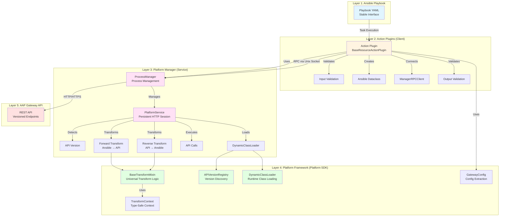

---

## Component Architecture

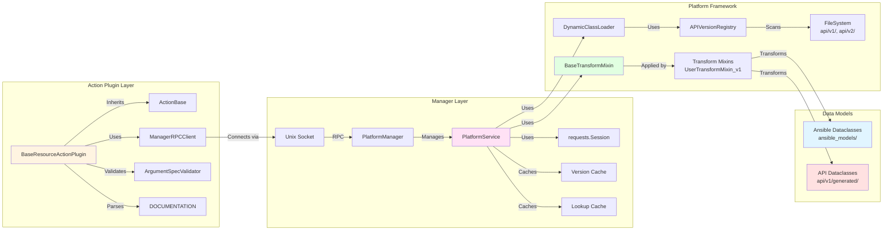

---

## Data Flow Architecture

```mermaid
flowchart TD
    Start[Playbook Task] --> Input[User Input<br/>organizations: ['Engineering']]
    
    Input --> Validate1[Action Plugin:<br/>Validate Input]
    Validate1 --> CreateDC[Create AnsibleUser<br/>organizations: ['Engineering']]
    
    CreateDC --> RPC[RPC Call via Unix Socket]
    RPC --> Manager[PlatformService]
    
    Manager --> LoadClasses[Load Version Classes<br/>AnsibleUser, APIUser_v1, UserTransformMixin_v1]
    
    LoadClasses --> Forward[Forward Transform<br/>to_api(context)]
    
    Forward --> Lookup[Lookup Org IDs<br/>lookup_org_ids(['Engineering'])]
    Lookup --> API1[API Call:<br/>GET /organizations/?name=Engineering]
    API1 --> OrgID[Returns: org_id=1]
    
    OrgID --> Transform1[Transform:<br/>organizations → organization_ids<br/>['Engineering'] → [1]]
    
    Transform1 --> APICall[API Call:<br/>POST /users/<br/>organization_ids: [1]]
    APICall --> APIResp[API Response:<br/>id: 123, organization_ids: [1]]
    
    APIResp --> Reverse[Reverse Transform<br/>to_ansible(context)]
    
    Reverse --> Lookup2[Lookup Org Names<br/>lookup_org_names([1])]
    Lookup2 --> API2[API Call:<br/>GET /organizations/1/]
    API2 --> OrgName[Returns: name='Engineering']
    
    OrgName --> Transform2[Transform:<br/>organization_ids → organizations<br/>[1] → ['Engineering']]
    
    Transform2 --> CreateResult[Create AnsibleUser Result<br/>organizations: ['Engineering']]
    
    CreateResult --> RPC2[RPC Return via Unix Socket]
    RPC2 --> Validate2[Action Plugin:<br/>Validate Output]
    Validate2 --> Output[Return to Playbook<br/>organizations: ['Engineering']]
    
    style Input fill:#e1f5ff
    style CreateDC fill:#e1f5ff
    style Transform1 fill:#fff4e1
    style APICall fill:#ffe1e1
    style Transform2 fill:#fff4e1
    style CreateResult fill:#e1f5ff
    style Output fill:#e1f5ff
```

---

## Manager Lifecycle

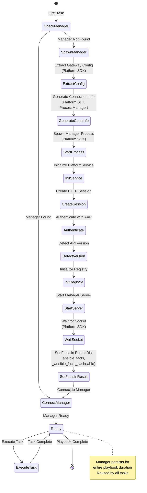

---

## Sequence Diagrams

### First Task: Spawning Manager

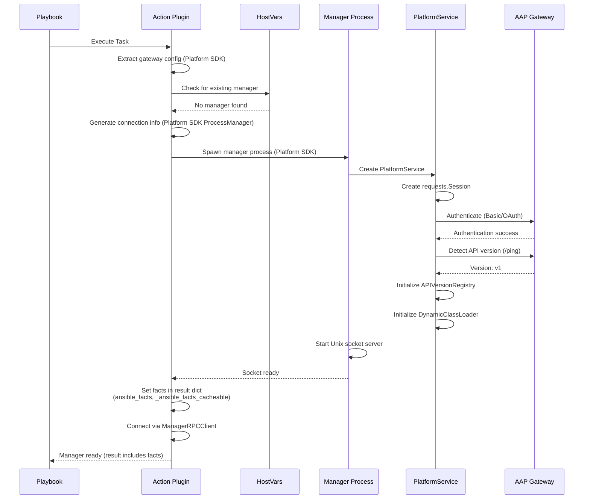

### Subsequent Task: Reusing Manager

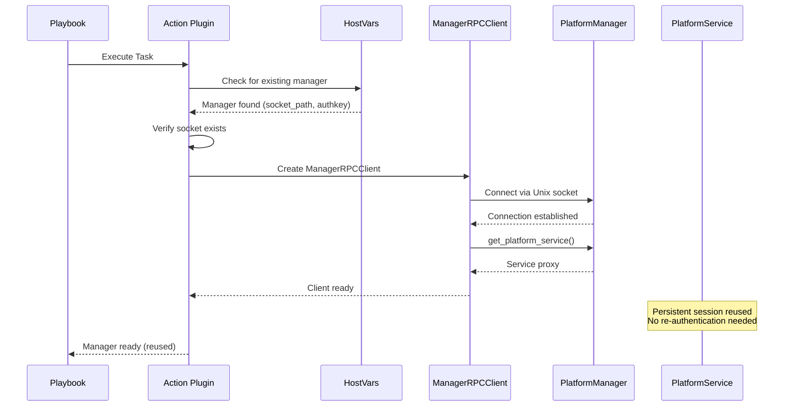

### Complete Create Operation

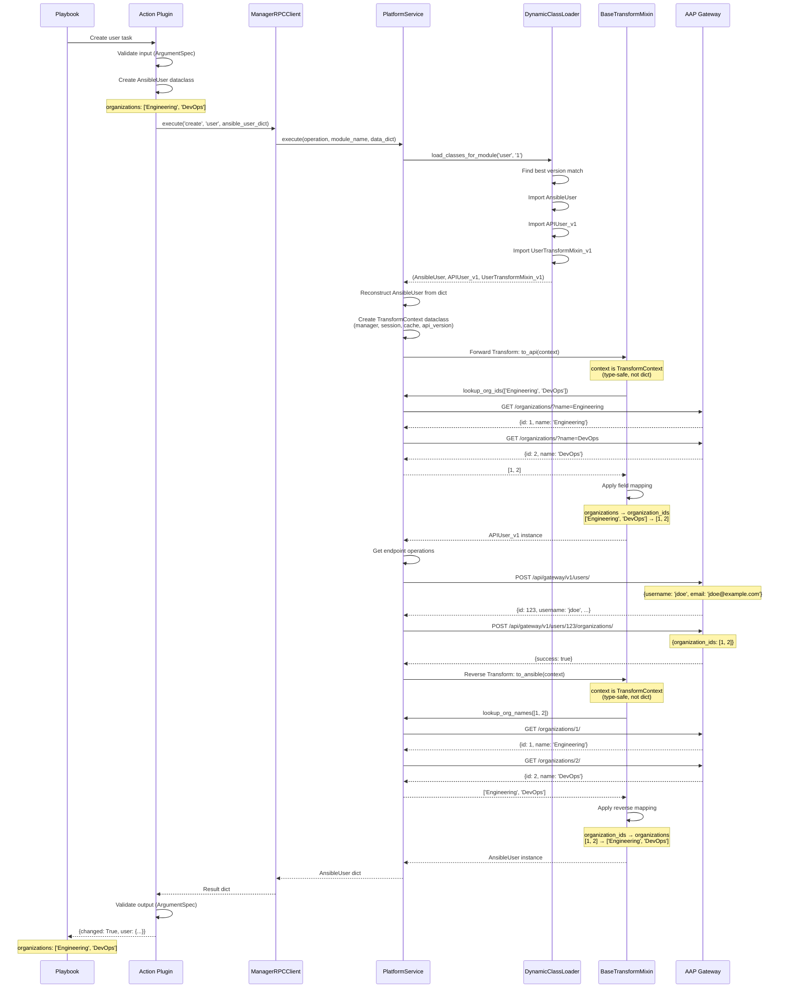

### Data Transformation Flow

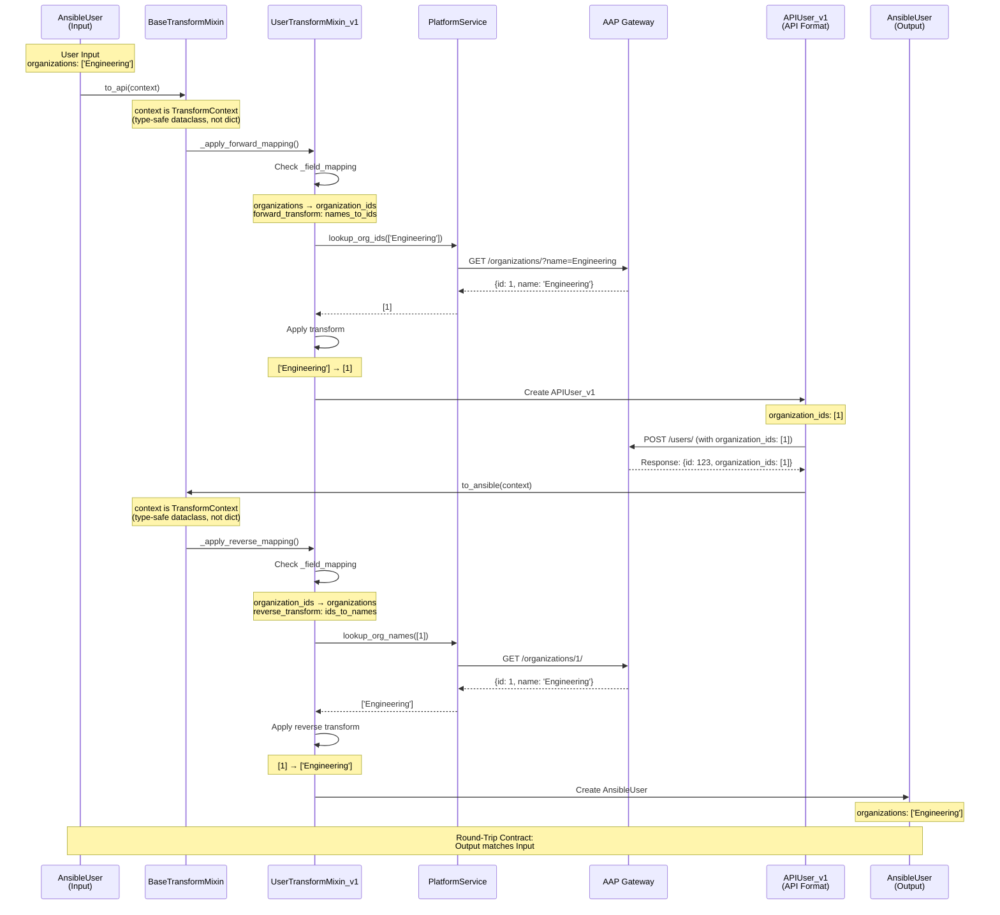

### Version Discovery and Class Loading

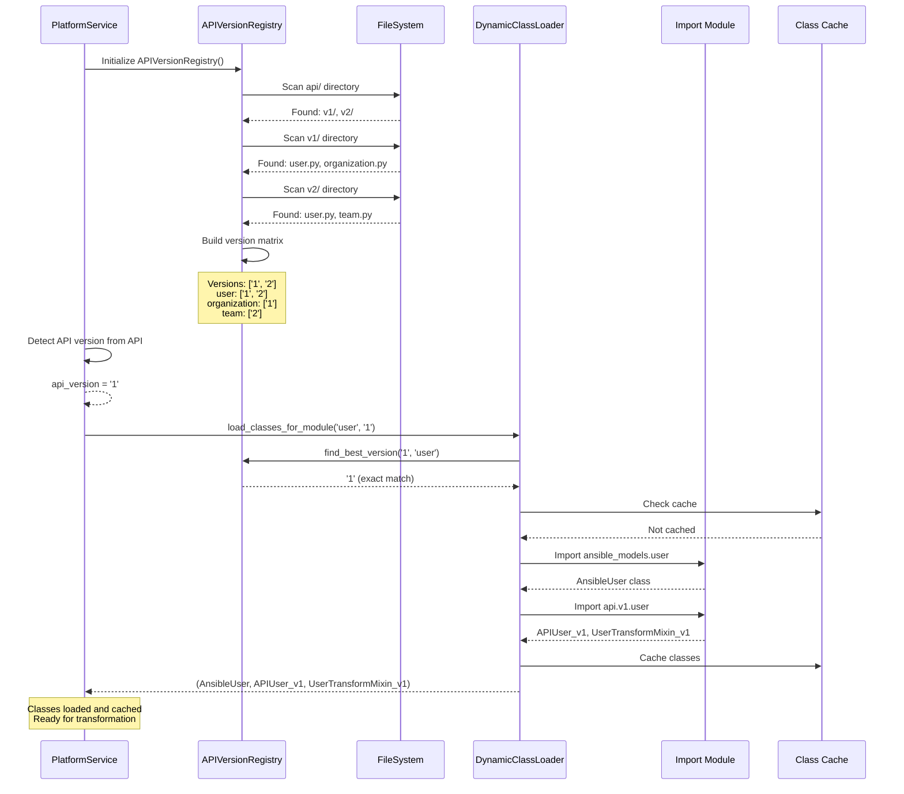

### Multi-Endpoint Operation

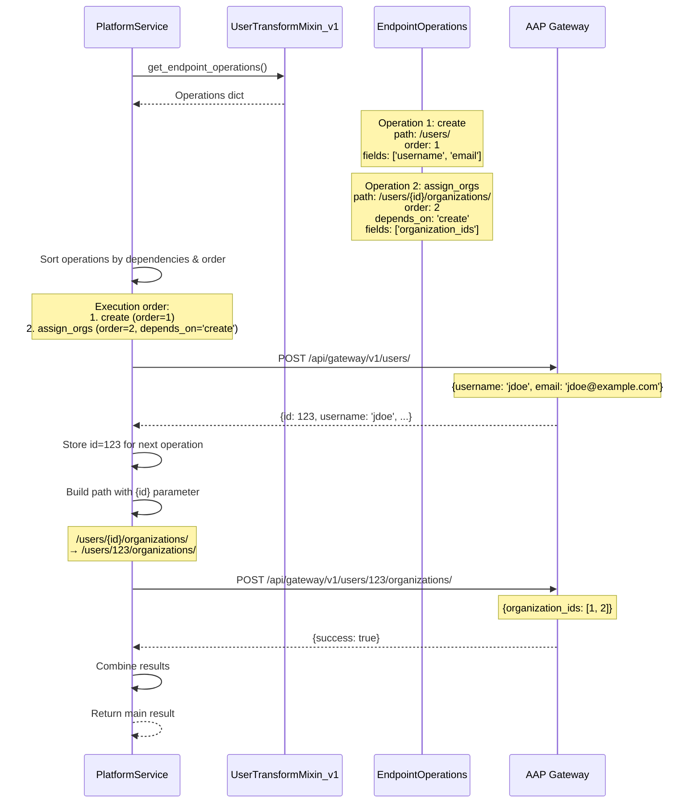

---

## Component Interaction Matrix

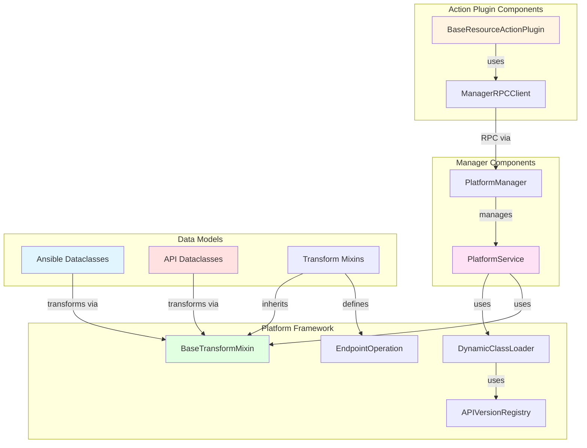

---

## File Structure and Dependencies

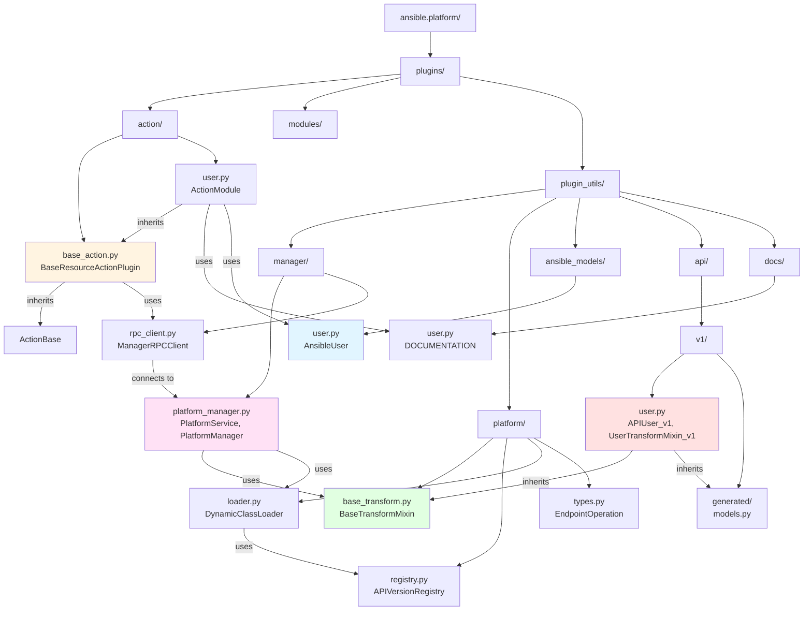

---

## Legend

### Color Coding

- **Blue** (`#e1f5ff`): User-facing components (Playbook, Ansible dataclasses)
- **Orange** (`#fff4e1`): Client layer (Action plugins)
- **Pink** (`#ffe1f5`): Service layer (Manager, PlatformService)
- **Green** (`#e1ffe1`): Framework layer (Transform, Registry, Loader)
- **Red** (`#ffe1e1`): API layer (API dataclasses, Gateway API)

### Diagram Types

1. **Graph Diagrams**: Show component relationships and architecture
2. **Flowchart Diagrams**: Show data flow and transformations
3. **State Diagrams**: Show state transitions and lifecycle
4. **Sequence Diagrams**: Show temporal interactions between components

---

## Notes

- All diagrams use **Mermaid syntax** and can be rendered in:
  - GitHub/GitLab markdown viewers
  - VS Code with Mermaid extension
  - Online Mermaid editors (mermaid.live)
  - Documentation tools (MkDocs, Docusaurus, etc.)

- **Sequence diagrams** show the temporal flow of operations
- **Architecture diagrams** show component relationships
- **Flow diagrams** show data transformation paths
- **State diagrams** show lifecycle and state transitions

---

## Related Documentation

- `ARCHITECTURE.md` - Detailed architecture documentation
- `FLOW_EXPLANATION.md` - Complete flow explanation
- `API_REFERENCE.md` - Component API reference
- `IMPLEMENTATION_GUIDE.md` - Implementation details

