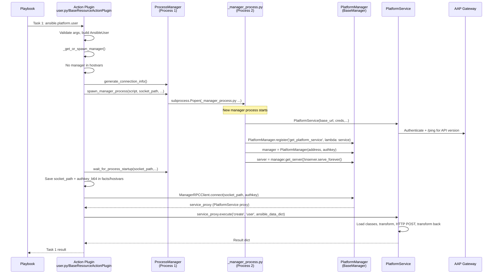
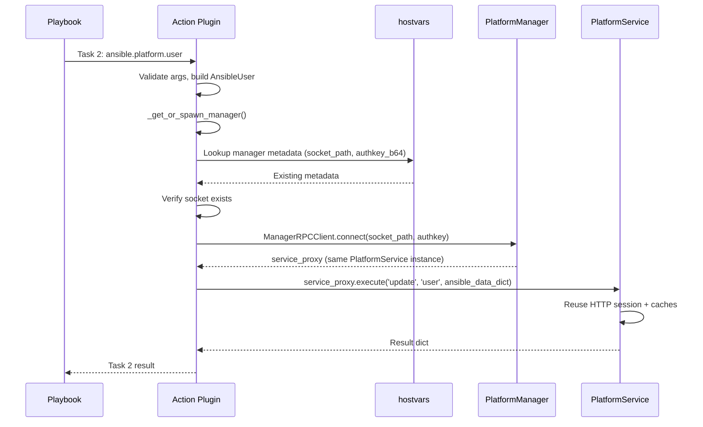

# End‑to‑End Flow: Persistent Manager for `ansible.platform`

This document explains, in one place:

- What happens on the **first** `ansible.platform.*` task (manager spawn)
- What happens on **subsequent** tasks (manager reuse)
- How the **manager process** is spawned and how `BaseManager` is used
- How processes, threads, and the shared `PlatformService` fit together
- Where API version detection and (future) shutdown logic live

It can be used both as architecture documentation and as code‑walkthrough notes for presentations.

---

## 0. Files and Components (Quick Map)

**Action layer**

- `plugins/action/user.py`
  - `ActionModule(BaseResourceActionPlugin)`
- `plugins/action/base_action.py`
  - `BaseResourceActionPlugin`
  - `_get_or_spawn_manager(...)`
  - `_build_ansible_dataclass(...)`, `_detect_operation(...)`, etc.

**Manager process & SDK**

- `plugins/plugin_utils/manager/process_manager.py`
  - `ProcessManager.generate_connection_info(...)`
  - `ProcessManager.spawn_manager_process(...)`
  - `ProcessManager.wait_for_process_startup(...)`
- `plugins/plugin_utils/manager/_manager_process.py`
  - Standalone script run in the child process
  - Creates `PlatformService`
  - Configures and starts `PlatformManager` (BaseManager server)
- `plugins/plugin_utils/manager/platform_manager.py`
  - `PlatformService` – persistent HTTP session, transforms, API calls
  - `PlatformManager(ThreadingMixIn, BaseManager)` – manager server
- `plugins/plugin_utils/manager/rpc_client.py`
  - `ManagerRPCClient` – client‑side BaseManager connector

**Versioning & transforms**

- `plugins/plugin_utils/platform/registry.py`
  - `APIVersionRegistry` – filesystem‑based version discovery
- `plugins/plugin_utils/platform/loader.py`
  - `DynamicClassLoader.load_classes_for_module(...)`
- `plugins/plugin_utils/platform/base_transform.py`
  - `BaseTransformMixin` – `to_api()` / `to_ansible()`
- `plugins/plugin_utils/platform/types.py`
  - `EndpointOperation`, `TransformContext`

**Dataclasses**

- `plugins/plugin_utils/ansible_models/user.py`
  - `AnsibleUser`
- `plugins/plugin_utils/api/v1/user.py`
  - `APIUser_v1`, `UserTransformMixin_v1`

---

## 1. Example Playbook

```yaml
- name: Demonstrate persistent manager reuse
  hosts: localhost
  gather_facts: false

  vars:
    gateway_hostname: "https://platform.example.com"
    gateway_token: "{{ lookup('env', 'AAP_TOKEN') }}"
    gateway_validate_certs: false

  tasks:
    - name: First task - create user (spawns manager)
      ansible.platform.user:
        gateway_hostname: "{{ gateway_hostname }}"
        gateway_token: "{{ gateway_token }}"
        gateway_validate_certs: "{{ gateway_validate_certs }}"
        username: demo1
        email: demo1@example.com
        state: present

    - name: Second task - update same user (reuses manager)
      ansible.platform.user:
        gateway_hostname: "{{ gateway_hostname }}"
        gateway_token: "{{ gateway_token }}"
        gateway_validate_certs: "{{ gateway_validate_certs }}"
        username: demo1
        email: demo1-updated@example.com
        state: present
```

---

## 2. High‑Level Sequence Diagrams

### 2.1 First Task – Manager Spawn



### 2.2 Subsequent Task – Manager Reuse



---

## 3. Detailed Flow – First Task

### 3.1 Action Plugin Entrypoint (user.py)

**File**: `plugins/action/user.py`

```python
from .base_action import BaseResourceActionPlugin

class ActionModule(BaseResourceActionPlugin):
    MODULE_NAME = 'user'
```

Ansible core:

1. Sees `ansible.platform.user` in the task.
2. Loads `ActionModule` and calls `run(tmp, task_vars)`.

---

### 3.2 `BaseResourceActionPlugin.run`

**File**: `plugins/action/base_action.py` (simplified)

```python
class BaseResourceActionPlugin(ActionBase):
    MODULE_NAME: str  # 'user', 'organization', etc.

    def run(self, tmp=None, task_vars=None):
        # 1. Input validation
        argspec = self._build_argspec_from_docs(DOCUMENTATION)
        validated_args = self._validate_data(self._task.args, argspec, 'input')

        # 2. Build stable Ansible dataclass (e.g., AnsibleUser)
        ansible_dataclass = self._build_ansible_dataclass(validated_args)

        # 3. Get or spawn manager
        client, facts_to_set = self._get_or_spawn_manager(task_vars)

        # 4. Determine operation (create/update/delete/find)
        operation = self._detect_operation(ansible_dataclass)

        # 5. Execute via manager
        result = client.execute(
            operation=operation,
            module_name=self.MODULE_NAME,
            ansible_data=ansible_dataclass,
        )

        # 6. Merge facts and finalize result (omitted here)
        ...

        return result
```

At this point:

- We have a validated `AnsibleUser`.
- We haven’t contacted AAP yet.
- We now need a Manager via `_get_or_spawn_manager`.

---

### 3.3 `_get_or_spawn_manager` – discovery and spawn

**File**: `plugins/action/base_action.py` (high‑level sketch)

```python
from ansible_collections.ansible.platform.plugins.plugin_utils.manager.process_manager import ProcessManager
from ansible_collections.ansible.platform.plugins.plugin_utils.manager.rpc_client import ManagerRPCClient

def _get_or_spawn_manager(self, task_vars):
    inventory_hostname = task_vars['inventory_hostname']

    # 1. Check for existing manager in hostvars
    hostvars = task_vars.get('hostvars', {})
    existing = self._get_existing_manager_info(hostvars, inventory_hostname)

    if existing and self._socket_is_valid(existing['socket_path']):
        authkey = base64.b64decode(existing['authkey_b64'])
        return ManagerRPCClient(
            base_url=existing['gateway_url'],
            socket_path=existing['socket_path'],
            authkey=authkey,
        ), {}

    # 2. No existing manager → spawn new one
    socket_dir = Path(self._get_socket_dir(task_vars))
    conn = ProcessManager.generate_connection_info(inventory_hostname, socket_dir)

    socket_path = conn.socket_path
    authkey_b64 = conn.authkey_b64
    gateway_config = self._extract_gateway_config(task_vars)

    process = ProcessManager.spawn_manager_process(
        script_path=self._get_manager_script_path(),  # _manager_process.py
        socket_path=socket_path,
        socket_dir=str(socket_dir),
        identifier=inventory_hostname,
        gateway_config=gateway_config,
        authkey_b64=authkey_b64,
        sys_path=list(sys.path),
    )

    ProcessManager.wait_for_process_startup(
        socket_path=socket_path,
        socket_dir=socket_dir,
        identifier=inventory_hostname,
        process=process,
    )

    facts_to_set = {
        'ansible_platform_manager_socket': socket_path,
        'ansible_platform_manager_authkey_b64': authkey_b64,
        'ansible_platform_gateway_url': gateway_config.base_url,
    }

    authkey = base64.b64decode(authkey_b64)
    client = ManagerRPCClient(
        base_url=gateway_config.base_url,
        socket_path=socket_path,
        authkey=authkey,
    )

    return client, facts_to_set
```

---

### 3.4 `ProcessManager.spawn_manager_process`


**File**: `plugins/plugin_utils/manager/process_manager.py`

```python
class ProcessManager:
    @staticmethod
    def generate_connection_info(identifier: str, socket_dir: Optional[Path] = None) -> ProcessConnectionInfo:
        socket_dir = socket_dir or (Path(tempfile.gettempdir()) / 'ansible_platform')
        socket_dir.mkdir(exist_ok=True)
        socket_path = str(socket_dir / f'manager_{identifier}.sock')
        authkey = secrets.token_bytes(32)
        authkey_b64 = base64.b64encode(authkey).decode('utf-8')
        return ProcessConnectionInfo(socket_path=socket_path, authkey=authkey, authkey_b64=authkey_b64)

    @staticmethod
    def spawn_manager_process(... ) -> subprocess.Popen:
        cmd = [
            sys.executable,
            str(script_path),  # _manager_process.py
            socket_path,
            socket_dir,
            identifier,
            gateway_config.base_url,
            gateway_config.username or '',
            gateway_config.password or '',
            gateway_config.oauth_token or '',
            str(gateway_config.verify_ssl),
            str(gateway_config.request_timeout),
        ]

        process = subprocess.Popen(
            cmd,
            env=env,
            stdout=subprocess.DEVNULL,
            stderr=subprocess.DEVNULL,
            start_new_session=True,
        )
        return process
```

- Starts a **new OS process** running `_manager_process.py`.
- Auth key and socket path are passed via env/args.

---

### 3.5 `_manager_process.py` – PlatformService + BaseManager server

**File**: `plugins/plugin_utils/manager/_manager_process.py`

```python
from ansible_collections.ansible.platform.plugins.plugin_utils.manager.platform_manager import (
    PlatformManager,
    PlatformService,
)

def main():
    # 1. Parse CLI args (socket_path, gateway_url, creds, timeouts, etc.)
    socket_path = sys.argv[1]
    socket_dir = sys.argv[2]
    identifier = sys.argv[3]
    gateway_url = sys.argv[4]
    gateway_username = sys.argv[5]
    gateway_password = sys.argv[6]
    gateway_token = sys.argv[7]
    gateway_validate_certs = sys.argv[8] == "True"
    gateway_request_timeout = float(sys.argv[9])

    # 2. Decode authkey + restore sys.path from env (omitted)

    # 3. Create PlatformService (persistent HTTP session, auth, API version detection)
    service = PlatformService(
        base_url=gateway_url,
        username=gateway_username or None,
        password=gateway_password or None,
        oauth_token=gateway_token or None,
        verify_ssl=gateway_validate_certs,
        request_timeout=gateway_request_timeout,
    )

    # 4. Register service with BaseManager subclass
    PlatformManager.register("get_platform_service", callable=lambda: service)

    # 5. Create BaseManager server and start serving
    manager = PlatformManager(address=socket_path, authkey=authkey)
    server = manager.get_server()
    server.serve_forever()  # Main thread blocks here
```

- `PlatformService`:
  - Creates a **persistent `requests.Session`**
  - Performs `_authenticate()` once
  - Performs `_detect_version()` once and caches `self.api_version`
  - Initializes `APIVersionRegistry` + `DynamicClassLoader`
- `PlatformManager(ThreadingMixIn, BaseManager)`:
  - Exposes `get_platform_service()`
  - Accepts connections on the Unix socket and spawns worker threads

---

### 3.6 `ManagerRPCClient` – client‑side BaseManager

**File**: `plugins/plugin_utils/manager/rpc_client.py`

```python
class ManagerRPCClient:
    def __init__(self, base_url: str, socket_path: str, authkey: bytes):
        from .platform_manager import PlatformManager

        PlatformManager.register('get_platform_service')

        self.manager = PlatformManager(
            address=socket_path,
            authkey=authkey,
        )
        self.manager.connect()

        self.service_proxy = self.manager.get_platform_service()

    def execute(self, operation: str, module_name: str, ansible_data: Any) -> Any:
        from dataclasses import asdict, is_dataclass

        data_dict = asdict(ansible_data) if is_dataclass(ansible_data) else ansible_data

        return self.service_proxy.execute(
            operation,
            module_name,
            data_dict,
        )
```

- Uses the same `PlatformManager` subclass, but in **client mode**.
- Gets a proxy to the single `PlatformService` instance in the manager process.

---

### 3.7 `PlatformService.execute` – transforms & HTTP calls

**File**: `plugins/plugin_utils/manager/platform_manager.py`

```python
class PlatformService:
    def __init__(...):
        self.session = requests.Session()
        self._authenticate()
        self.api_version = self._detect_version()
        self.registry = APIVersionRegistry()
        self.loader = DynamicClassLoader(self.registry)
        self.cache: Dict[str, Any] = {}

    def execute(self, operation: str, module_name: str, ansible_data_dict: dict) -> dict:
        AnsibleClass, APIClass, MixinClass = self.loader.load_classes_for_module(
            module_name,
            self.api_version,
        )

        ansible_instance = AnsibleClass(**ansible_data_dict)

        context = TransformContext(
            manager=self,
            session=self.session,
            cache=self.cache,
            api_version=self.api_version,
        )

        if operation == 'create':
            return self._create_resource(ansible_instance, MixinClass, context)
        elif operation == 'update':
            ...
```

- Uses `DynamicClassLoader.load_classes_for_module(...)` to load:
  - `AnsibleUser` from `ansible_models/user.py`
  - `APIUser_v1` + `UserTransformMixin_v1` from `api/v1/user.py`
- Uses `MixinClass.to_api(...)` / `from_api(...)` for transformations.
- Executes HTTP requests via the shared `requests.Session`.

---

## 4. Detailed Flow – Second Task (Reuse)

For the second `ansible.platform.user` task:

1. `ActionModule.run()` and validation are the same.
2. `_get_or_spawn_manager(...)`:
   - Finds `ansible_platform_manager_socket` and `ansible_platform_manager_authkey_b64` in hostvars/facts.
   - Verifies that the socket file exists.
   - Skips `spawn_manager_process` and reuses the same `socket_path` + `authkey_b64`.
   - Builds a new `ManagerRPCClient` pointing at the existing manager.
3. `ManagerRPCClient` connects to `PlatformManager` and retrieves a proxy to the same `PlatformService`.
4. `PlatformService.execute(...)`:
   - Reuses the same `requests.Session` (connection pooling, TLS session reuse).
   - Reuses the cached API version and lookup caches.

This is how we get **persistent connections and shared state** across tasks.

---

## 5. Processes and Threads Diagram

```mermaid
flowchart TD
    subgraph P1[Process 1: Ansible Playbook]
      AP1[Action Plugin\nTask 1]
      AP2[Action Plugin\nTask 2]
      MRC1[ManagerRPCClient\n(Task 1)]
      MRC2[ManagerRPCClient\n(Task 2)]
    end

    subgraph P2[Process 2: Manager Process\n(_manager_process.py)]
      MT[Main Thread\nserver.serve_forever()]
      WT1[Worker Thread 1\nhandles Task 1 RPC]
      WT2[Worker Thread 2\nhandles Task 2 RPC]
      SVC[PlatformService\n(single instance)]
    end

    AP1 --> MRC1
    AP2 --> MRC2
    MRC1 -->|Unix socket| MT
    MRC2 -->|Unix socket| MT

    MT -->|accept connection| WT1
    MT -->|accept connection| WT2

    WT1 -->|call execute(...)| SVC
    WT2 -->|call execute(...)| SVC
```

---

## 6. API Version Detection (Where it Happens)

**File**: `plugins/plugin_utils/manager/platform_manager.py`

```python
def _detect_version(self) -> str:
    response = self.session.get(
        f'{self.base_url}/api/gateway/v1/ping/',
        timeout=self.request_timeout,
        verify=self.verify_ssl,
    )
    response.raise_for_status()

    version_str = '1'
    if response.headers.get('X-API-Version'):
        version_str = response.headers['X-API-Version']
    elif response.json().get('version'):
        version_str = str(response.json()['version'])

    if version_str.startswith('v'):
        version_str = version_str[1:]
    return version_str
```

- Called once in `PlatformService.__init__`.
- `self.api_version` is then used by `DynamicClassLoader` for all calls.

---

## 7. Shutdown (Target Design)

See `docs/MANAGER_SHUTDOWN.md` for full details. High‑level idea:

- Track `subprocess.Popen` handles in `BaseResourceActionPlugin`.
- On playbook completion:
  - Use `ManagerRPCClient` to call `PlatformService.shutdown()` via RPC.
  - `shutdown()` closes the HTTP session and triggers `server.shutdown()` in the manager.
  - Wait for `process.wait(timeout=5)`.
  - If still alive, call `process.kill()` (PID‑based fallback).
  - Use `ProcessManager.cleanup_old_socket(socket_path)` to remove socket files.

This yields a **graceful shutdown** path with a **PID‑based safety net**, keeping the architecture collection‑scoped and operationally safe.

---

This file serves as the single source of truth for:

- First vs. subsequent task behavior
- Manager spawning, BaseManager usage, and RPC wiring
- Threading and process topology
- Where versioning and shutdown hooks live

Use it as a reference for code reviews, onboarding, and architecture presentations.


