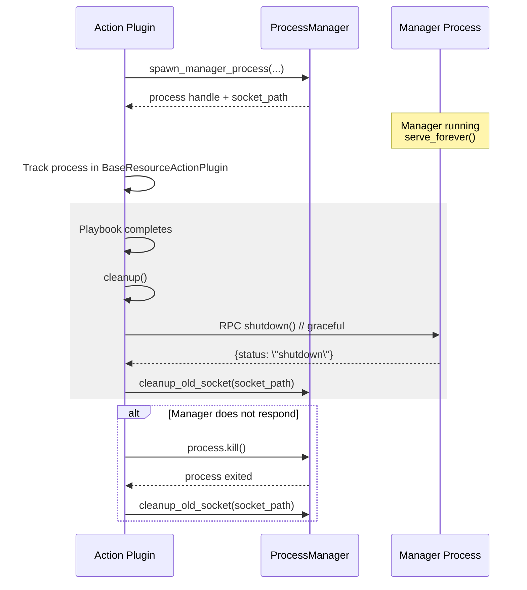

# Manager Process Shutdown Mechanism

## High-Level Shutdown Flow (Target State)



## Current State

### How Manager Process is Spawned

The manager process is spawned via `subprocess.Popen` in `base_action.py`:

```python
# In process_manager.py:159-167
process = subprocess.Popen(
    cmd,
    env=env,
    stdout=subprocess.DEVNULL,
    stderr=subprocess.DEVNULL,
    start_new_session=True  # Detaches from parent process
)
```

**Key Points**:
- Process is spawned with `start_new_session=True`, which detaches it from the parent
- Process object is returned but **NOT stored anywhere** (discarded after waiting for socket)
- Manager process runs `server.serve_forever()` which blocks indefinitely
- No explicit cleanup mechanism exists

### Current Shutdown Behavior

**Problem**: The manager process currently relies on **implicit cleanup**:

1. **When parent (ansible-playbook) terminates**:
   - If process is still attached: OS sends SIGTERM/SIGKILL
   - If process is detached (`start_new_session=True`): Process may survive as orphan
   - Socket file remains on filesystem

2. **No graceful shutdown**:
   - Manager process doesn't handle shutdown signals
   - No cleanup of socket files
   - No cleanup of HTTP session resources
   - No logging of shutdown events

3. **Resource leaks**:
   - Orphaned processes if parent crashes
   - Socket files left on filesystem
   - HTTP connections not properly closed

## Proposed Solutions

### Option 1: Process Tracking + Cleanup Hook (Recommended)

**Implementation**:

1. **Track spawned processes** in a class variable:
```python
# In base_action.py
class BaseResourceActionPlugin(ActionBase):
    _spawned_processes = {}  # {socket_path: process}
    
    def _get_or_spawn_manager(self, task_vars):
        # ... existing code ...
        process = ProcessManager.spawn_manager_process(...)
        
        # Track process
        self._spawned_processes[socket_path] = process
        
        return client, facts_to_set
```

2. **Implement cleanup() method**:
```python
# In base_action.py
def cleanup(self, force=False):
    """Clean up manager processes on playbook completion."""
    super().cleanup(force)
    
    # Shutdown all tracked manager processes
    for socket_path, process in self._spawned_processes.items():
        if process.poll() is None:  # Process still running
            try:
                # Send shutdown signal to manager
                self._shutdown_manager(socket_path)
                # Wait for graceful shutdown
                process.wait(timeout=5)
            except subprocess.TimeoutExpired:
                # Force kill if graceful shutdown fails
                process.kill()
                process.wait()
            except Exception as e:
                logger.warning(f"Error shutting down manager at {socket_path}: {e}")
                # Force kill as fallback
                try:
                    process.kill()
                except:
                    pass
        
        # Clean up socket file
        ProcessManager.cleanup_old_socket(socket_path)
    
    # Clear tracking dict
    self._spawned_processes.clear()
```

3. **Add shutdown RPC method** to manager:
```python
# In platform_manager.py
class PlatformService:
    def shutdown(self):
        """Gracefully shutdown the service."""
        logger.info("Shutting down PlatformService")
        if self.session:
            self.session.close()
        # Signal to server to stop
        return {'status': 'shutdown'}
```

4. **Handle shutdown in manager process**:
```python
# In manager_process.py
import signal

def signal_handler(signum, frame):
    """Handle shutdown signals."""
    logger.info(f"Received signal {signum}, shutting down...")
    if hasattr(server, 'shutdown'):
        server.shutdown()
    sys.exit(0)

signal.signal(signal.SIGTERM, signal_handler)
signal.signal(signal.SIGINT, signal_handler)
```

### Option 2: File-Based Heartbeat + Timeout

**Implementation**:

1. **Manager writes heartbeat file** periodically:
```python
# In manager_process.py
import time

heartbeat_file = Path(socket_dir) / f'manager_heartbeat_{identifier}.txt'

while True:
    # Update heartbeat
    heartbeat_file.write_text(str(time.time()))
    time.sleep(1)
    
    # Check if parent is still alive (check parent PID)
    try:
        os.kill(parent_pid, 0)  # Check if process exists
    except OSError:
        # Parent died, shutdown
        logger.info("Parent process died, shutting down...")
        break
```

2. **Action plugin checks heartbeat** and cleans up stale processes:
```python
# In base_action.py
def _check_manager_health(self, socket_path):
    heartbeat_file = Path(socket_dir) / f'manager_heartbeat_{identifier}.txt'
    if heartbeat_file.exists():
        last_heartbeat = float(heartbeat_file.read_text())
        if time.time() - last_heartbeat > 30:  # 30 second timeout
            # Manager is stale, clean up
            ProcessManager.cleanup_old_socket(socket_path)
            return False
    return True
```

### Option 3: Ansible Callback Plugin for Cleanup

**Implementation**:

1. **Create callback plugin** that runs on playbook completion:
```python
# plugins/callback/manager_cleanup.py
from ansible.plugins.callback import CallbackBase

class CallbackModule(CallbackBase):
    def v2_playbook_on_stats(self, stats):
        """Called at end of playbook."""
        # Find and shutdown all manager processes
        socket_dir = Path('/tmp/ansible_platform')
        for socket_file in socket_dir.glob('manager_*.sock'):
            # Send shutdown signal via RPC
            # Clean up socket
            socket_file.unlink()
```

## Recommended Approach: Hybrid Solution

Combine **Option 1** (process tracking + cleanup hook) with **signal handling** in manager process:

### Implementation Steps

1. **Track processes** in `BaseResourceActionPlugin`
2. **Implement cleanup()** method to shutdown tracked processes
3. **Add signal handling** in manager process for graceful shutdown
4. **Add shutdown RPC method** for explicit shutdown requests
5. **Clean up socket files** on shutdown

### Benefits

- ✅ Graceful shutdown with proper resource cleanup
- ✅ Handles both normal playbook completion and crashes
- ✅ Cleans up socket files
- ✅ Closes HTTP sessions properly
- ✅ Logs shutdown events for debugging

### Code Changes Required

1. **base_action.py**: Add process tracking and cleanup()
2. **manager_process.py**: Add signal handlers
3. **platform_manager.py**: Add shutdown() method
4. **process_manager.py**: Add shutdown_manager() helper

## Current Workaround

Until proper shutdown is implemented:

1. **Manual cleanup**: Socket files in `/tmp/ansible_platform/` can be manually deleted
2. **Process cleanup**: Orphaned processes can be killed manually:
   ```bash
   ps aux | grep manager_process.py
   kill <PID>
   ```
3. **Automatic cleanup on next run**: Old sockets are cleaned up when spawning new manager

## Future Enhancements

1. **Idle timeout**: Manager shuts down after period of inactivity
2. **Health checks**: Periodic health checks to detect stale managers
3. **Process monitoring**: Background process to monitor and clean up orphaned managers
4. **Configuration**: Configurable timeout and cleanup behavior

