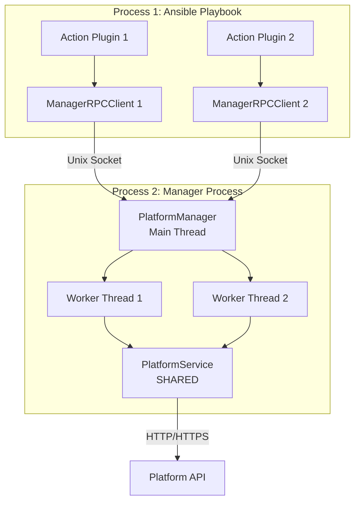
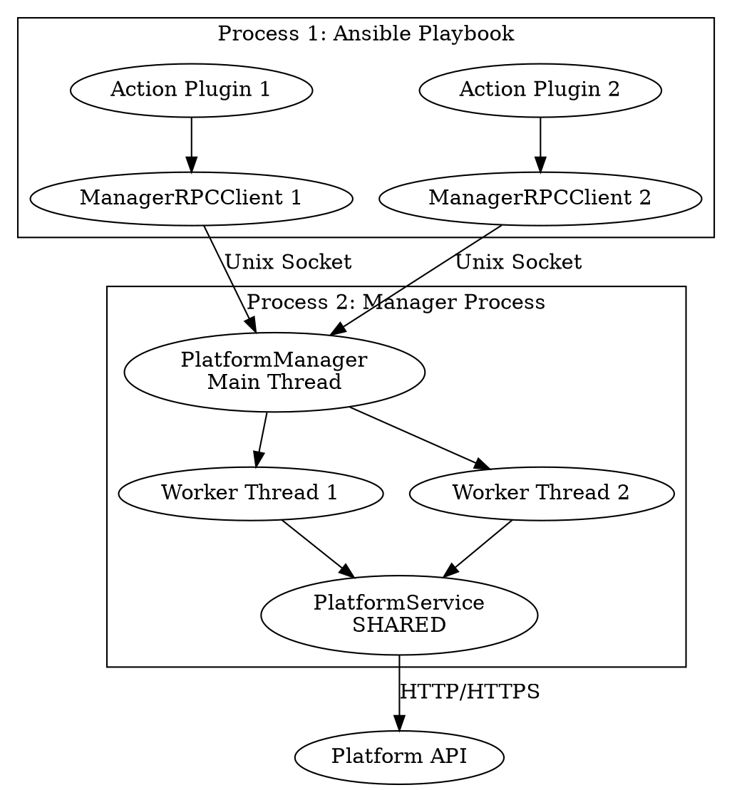

# Process, Thread, and Service Architecture

## Overview

This document describes the process, thread, and service architecture of the Ansible Platform Collection's persistent connection manager.

## Architecture Summary

### Processes (2 total)

1. **Ansible Playbook Process** (Main Process)
   - Runs `ansible-playbook`
   - Contains action plugins (user.py, base_action.py)
   - Spawns manager process on first task
   - Multiple action plugin instances (one per task)

2. **Manager Process** (Child Process)
   - Spawned via `subprocess.Popen` (runs `manager_process.py`)
   - Runs independently from parent
   - Contains PlatformService and PlatformManager
   - Handles all API communication
   - Persists for entire playbook duration

### Threads

- **Manager Process**: Uses `ThreadingMixIn` with `BaseManager`
  - Main thread: Runs `server.serve_forever()` (listens for connections)
  - Worker threads: One per concurrent RPC client connection
  - Thread-safe: Multiple action plugins can connect simultaneously

### Services

1. **PlatformService** (Created in Manager Process)
   - The actual service that performs operations
   - Maintains persistent HTTP session
   - Handles transformations and API calls
   - Created once per manager process
   - Shared via RPC proxy

2. **PlatformManager** (BaseManager wrapper)
   - Extends `BaseManager` with `ThreadingMixIn`
   - Registers `get_platform_service()` method
   - Provides Unix socket-based RPC
   - Manages thread pool for concurrent clients

### Communication Channels

1. **Action Plugin → Manager**: Unix Domain Socket (RPC)
   - Path: `/tmp/ansible_platform/manager_{hostname}.sock`
   - Protocol: BaseManager RPC (pickle-based)
   - Thread-safe: Multiple concurrent connections

2. **Manager → Platform API**: HTTP/HTTPS
   - Persistent `requests.Session`
   - Reused across all tasks
   - Authenticated once on startup

---

## Detailed Architecture Diagram

```
┌─────────────────────────────────────────────────────────────────────────┐
│                    PROCESS 1: Ansible Playbook Process                  │
│                         (ansible-playbook)                              │
│                                                                         │
│  ┌──────────────────────────────────────────────────────────────────┐  │
│  │  Action Plugin: user.py                                         │  │
│  │  ┌────────────────────────────────────────────────────────────┐ │  │
│  │  │ 1. Validates input                                         │ │  │
│  │  │ 2. Creates AnsibleUser dataclass                          │ │  │
│  │  │ 3. Gets/spawns manager                                     │ │  │
│  │  │ 4. Calls manager.execute() via RPC                        │ │  │
│  │  │ 5. Validates output                                       │ │  │
│  │  └────────────────────────────────────────────────────────────┘ │  │
│  └───────────────────────────┬──────────────────────────────────────┘  │
│                              │                                          │
│  ┌───────────────────────────▼──────────────────────────────────────┐  │
│  │  ManagerRPCClient (in action plugin process)                    │  │
│  │  ┌────────────────────────────────────────────────────────────┐ │  │
│  │  │ - Connects to Unix socket                                 │ │  │
│  │  │ - Gets service_proxy via manager.get_platform_service()   │ │  │
│  │  │ - Calls service_proxy.execute() (RPC call)                │ │  │
│  │  └────────────────────────────────────────────────────────────┘ │  │
│  └───────────────────────────┬──────────────────────────────────────┘  │
│                              │                                          │
│                              │ Unix Domain Socket                       │
│                              │ /tmp/ansible_platform/manager_*.sock    │
│                              │ (RPC via BaseManager)                    │
└──────────────────────────────┼──────────────────────────────────────────┘
                                │
                                │ subprocess.Popen
                                │ (spawns once on first task)
                                │
┌───────────────────────────────▼──────────────────────────────────────────┐
│                    PROCESS 2: Manager Process                            │
│                    (manager_process.py)                                  │
│                                                                          │
│  ┌──────────────────────────────────────────────────────────────────┐   │
│  │  PlatformManager (BaseManager + ThreadingMixIn)                │   │
│  │  ┌────────────────────────────────────────────────────────────┐  │   │
│  │  │ Main Thread: server.serve_forever()                       │  │   │
│  │  │ - Listens on Unix socket                                  │  │   │
│  │  │ - Accepts incoming RPC connections                       │  │   │
│  │  │ - Spawns worker thread per connection                     │  │   │
│  │  └────────────────────────────────────────────────────────────┘  │   │
│  │                                                                  │   │
│  │  ┌────────────────────────────────────────────────────────────┐  │   │
│  │  │ Worker Thread 1: Handles RPC call from Action Plugin 1    │  │   │
│  │  │ - Receives execute() call                                  │  │   │
│  │  │ - Gets PlatformService proxy                               │  │   │
│  │  │ - Calls service.execute()                                 │  │   │
│  │  └────────────────────────────────────────────────────────────┘  │   │
│  │                                                                  │   │
│  │  ┌────────────────────────────────────────────────────────────┐  │   │
│  │  │ Worker Thread 2: Handles RPC call from Action Plugin 2    │  │   │
│  │  │ (if concurrent tasks)                                      │  │   │
│  │  └────────────────────────────────────────────────────────────┘  │   │
│  │                                                                  │   │
│  │  ┌────────────────────────────────────────────────────────────┐  │   │
│  │  │ Worker Thread N: Handles RPC call from Action Plugin N    │  │   │
│  │  │ (ThreadingMixIn handles concurrent connections)           │  │   │
│  │  └────────────────────────────────────────────────────────────┘  │   │
│  └───────────────────────────┬──────────────────────────────────────┘   │
│                              │                                          │
│                              │ Direct method call (same process)        │
│                              │                                          │
│  ┌───────────────────────────▼──────────────────────────────────────┐   │
│  │  PlatformService (SINGLE INSTANCE - shared by all threads)      │   │
│  │  ┌────────────────────────────────────────────────────────────┐  │   │
│  │  │ - Persistent requests.Session (thread-safe)               │  │   │
│  │  │ - API version detection (cached)                          │  │   │
│  │  │ - Transformations (Ansible ↔ API)                         │  │   │
│  │  │ - API calls (HTTP/HTTPS)                                  │  │   │
│  │  │ - Lookup cache (org names ↔ IDs)                         │  │   │
│  │  └────────────────────────────────────────────────────────────┘  │   │
│  └───────────────────────────┬──────────────────────────────────────┘   │
│                              │                                          │
│                              │ HTTP/HTTPS                                │
│                              │ Persistent Session                        │
└──────────────────────────────┼──────────────────────────────────────────┘
                                │
                                │
┌───────────────────────────────▼──────────────────────────────────────────┐
│                    Platform API (AAP Gateway)                            │
│                    - REST API endpoints                                   │
│                    - Version-specific schemas                             │
│                    - Authentication (Basic/OAuth)                         │
└──────────────────────────────────────────────────────────────────────────┘
```

---

## Process Lifecycle

### 1. Playbook Starts

```
Ansible Playbook Process
  └─> Loads action plugin (user.py)
      └─> First task calls _get_or_spawn_manager()
          └─> No manager found in hostvars
              └─> Spawns Manager Process (subprocess.Popen)
```

### 2. Manager Process Startup

```
Manager Process (manager_process.py)
  ├─> Reads arguments and environment variables
  ├─> Restores sys.path from parent
  ├─> Creates PlatformService
  │   ├─> Creates requests.Session
  │   ├─> Authenticates with AAP Gateway
  │   ├─> Detects API version
  │   └─> Initializes registry and loader
  ├─> Registers PlatformService with PlatformManager
  │   └─> PlatformManager.register('get_platform_service', lambda: service)
  ├─> Creates PlatformManager instance
  ├─> Gets server: server = manager.get_server()
  └─> Starts server: server.serve_forever()  [BLOCKS HERE]
      └─> Main thread listens for connections
```

### 3. Action Plugin Connects

```
Action Plugin (in Ansible Process)
  └─> Creates ManagerRPCClient
      ├─> Connects to Unix socket
      ├─> Gets service_proxy = manager.get_platform_service()
      └─> service_proxy is a proxy object (not the actual service)
```

### 4. Task Execution

```
Action Plugin
  └─> Calls manager.execute('create', 'user', user_data)
      └─> ManagerRPCClient.execute()
          └─> service_proxy.execute()  [RPC CALL]
              └─> Unix Socket → Manager Process
                  └─> PlatformManager receives call
                      └─> Spawns worker thread (ThreadingMixIn)
                          └─> Worker thread calls PlatformService.execute()
                              └─> PlatformService performs:
                                  ├─> Forward transform (Ansible → API)
                                  ├─> HTTP POST to API
                                  ├─> Reverse transform (API → Ansible)
                                  └─> Returns result
                              └─> Result sent back via RPC
                                  └─> Action Plugin receives result
```

### 5. Subsequent Tasks

```
Action Plugin (Task 2, 3, ...)
  └─> Calls _get_or_spawn_manager()
      └─> Finds manager in hostvars
          └─> Connects to EXISTING manager
              └─> Reuses PlatformService (same HTTP session)
```

### 6. Playbook Ends

```
Ansible Playbook Process
  └─> Playbook completes
      └─> Manager Process (daemon)
          └─> Continues running until:
              ├─> Parent process terminates (orphaned)
              └─> System cleanup (socket removed)
```

---

## Key Points

### Process Isolation

- **Action Plugin Process**: Stateless, no API knowledge
- **Manager Process**: Stateful, all API logic
- **Communication**: RPC over Unix socket (inter-process)

### Thread Safety

- **PlatformService**: Thread-safe (requests.Session is thread-safe)
- **PlatformManager**: Uses ThreadingMixIn for concurrent clients
- **Multiple Tasks**: Can run concurrently, each gets its own worker thread

### Service Sharing

- **PlatformService**: Created ONCE in manager process
- **Shared via RPC**: All action plugins get proxy to same service
- **Persistent Session**: HTTP session reused across all tasks
- **Cache**: Lookup cache shared across all tasks

### Resource Creation

**Which process creates the sharable resource?**

- **Manager Process** creates `PlatformService` (the sharable resource)
- Created in `manager_process.py:138-145`
- Registered with `PlatformManager` in `manager_process.py:161-164`
- Shared via RPC proxy to all action plugins

---

## Diagram Generation Instructions

### For Mermaid Diagrams



### For PlantUML Diagrams

```plantuml
@startuml
package "Process 1: Ansible Playbook" {
    [Action Plugin 1] as AP1
    [Action Plugin 2] as AP2
    [ManagerRPCClient 1] as RPC1
    [ManagerRPCClient 2] as RPC2
}

package "Process 2: Manager Process" {
    [PlatformManager\nMain Thread] as PM
    [Worker Thread 1] as WT1
    [Worker Thread 2] as WT2
    [PlatformService\nSHARED] as PS
}

[Platform API] as API

AP1 --> RPC1
AP2 --> RPC2
RPC1 -->|Unix Socket| PM
RPC2 -->|Unix Socket| PM
PM --> WT1
PM --> WT2
WT1 --> PS
WT2 --> PS
PS -->|HTTP/HTTPS| API
@enduml
```

### For Graphviz (DOT)



---

## File Locations

| Component | File | Line | Description |
|-----------|------|------|-------------|
| **Manager Process Entry** | `plugins/plugin_utils/manager/manager_process.py` | 16-194 | Main entry point for manager process |
| **PlatformService Creation** | `plugins/plugin_utils/manager/manager_process.py` | 138-145 | Creates the sharable service |
| **PlatformManager Registration** | `plugins/plugin_utils/manager/manager_process.py` | 161-164 | Registers service with manager |
| **PlatformManager Definition** | `plugins/plugin_utils/manager/platform_manager.py` | 680-685 | BaseManager + ThreadingMixIn |
| **PlatformService Class** | `plugins/plugin_utils/manager/platform_manager.py` | 24-719 | The actual service implementation |
| **Manager Spawning** | `plugins/action/base_action.py` | 307-325 | subprocess.Popen spawns manager |
| **RPC Client** | `plugins/plugin_utils/manager/rpc_client.py` | 31-65 | Client-side RPC connection |

---

## Summary

- **2 Processes**: Ansible Playbook Process + Manager Process
- **1+ Threads in Manager**: Main thread + worker threads (one per concurrent connection)
- **1 Service**: PlatformService (created once, shared via RPC)
- **Communication**: Unix Socket (RPC) between processes, HTTP/HTTPS to API
- **Resource Creation**: Manager Process creates PlatformService in `manager_process.py:138-145`
- **Sharing Mechanism**: BaseManager RPC proxy (all clients get proxy to same service instance)
